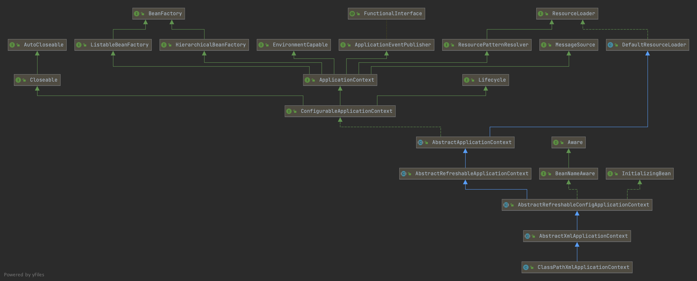
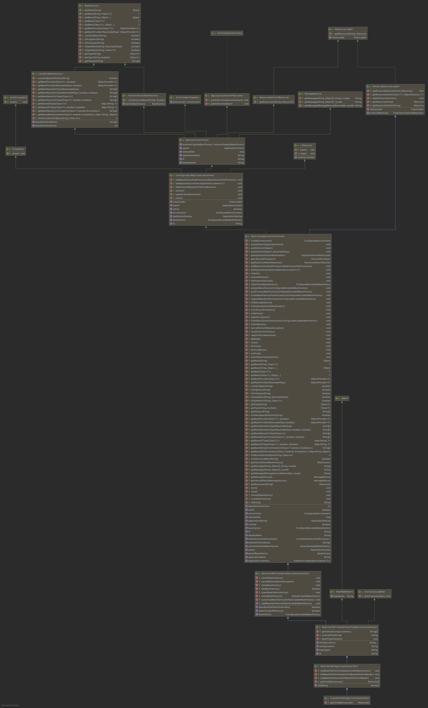
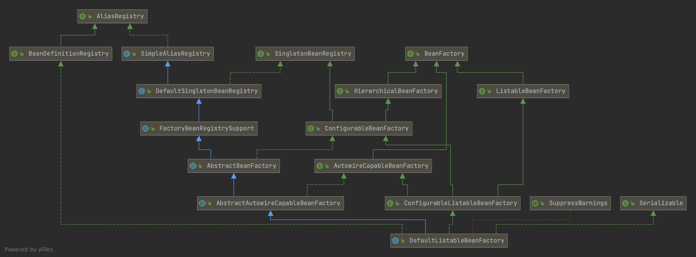

# spring core 基础解析

首先从ClasspathXmlApplicationContext入手,对Spring的ioc容器初始化进行一个简单的入门认识
本文采用的spring版本为```5.3.8```


上面这个图展示了ClassPathXmlApplicationContext的继承和依赖关系,实际看的时候可以把每个类或接口的属性及方法都打开一起查看,这样会有一个新的认识.

下面上一个完整版的uml图


可以看到的是,ClassPathXmlApplicationContext中的实现方法中,有一个```getConfigLocations```方法,是不是很符合这个类的命名  
而它的父类AbstractXmlApplicationContext中的```loadBeanDefinitions``` 方法就是读取xml的关键  
看到这里,是不是要稍微感慨一下spring中涉及到的设计模式(笔者在这里还是暂停了一下去看了几眼的设计模式)  
再往上看就到了AbstractApplicationContext了,spring中至关重要的方法```refresh```的具体就在这里,接下来我们就来详细的看一下这里的具体流程吧

### 正式解读源码
#### 入口
这个不做赘述
```java
    public static void main(String[] args) {
        ApplicationContext applicationContext = new ClassPathXmlApplicationContext("classpath:spring-context.xml");
        Animal animal = applicationContext.getBean(Animal.class);
        animal.eat("banana");
    }
```

#### 第一层 ClassPathXmlApplicationContext
它其实在构造函数里面设置了父级ApplicationContext,但是我们这里没有,所以先跳过,不过按照构造函数一直追踪到最顶层,发现最顶层父类设置了一个变量```ResourcePatternResolver```
这个变量的作用是读取```configLocations```,来供接下来解析用
1. 调用```org.springframework.context.support.AbstractRefreshableConfigApplicationContext.setConfigLocations```
2. 调用```org.springframework.context.support.AbstractApplicationContext.refresh```

#### 第二层 AbstractApplicationContext
这里马上就进入到了我们的关键函数 ```refresh```,这个函数至关重要,我们就来看看吧.
1. prepareRefresh 这个方法里面干的事情挺简单, 初始化环境变量并且准备了下listener变量
2. obtainFreshBeanFactory 这个方法在我看来其实挺重要的,因为他不只是简简单单创建了一个 beanFactory,他还去loadBeanDefinition,如果不看loadBeanDefinition,那么spring的aop咋加载进来的都不知道  
    2.1 createBeanFactory = ```new DefaultListableBeanFactory(getInternalParentBeanFactory())```
   其中这里的内部父beanFactory就是在第一层里面设置的父级ApplicationContext,哎呀,你要说一会beanFactory,一会ApplicationContext,弄的你头都晕了,仔细看第一个uml图,你就不会再这么晕下去了  
    2.2 ```org.springframework.context.support.AbstractRefreshableApplicationContext.loadBeanDefinitions``` 这个东西比较多,单独起一层来进行

3. org.springframework.context.support.AbstractApplicationContext.prepareBeanFactory
   这个方法里面自己去看下吧,只是实例化和设置变量,没有实际性关键操作

4. org.springframework.context.support.AbstractApplicationContext.postProcessBeanFactory
   这个其实挺关键的,虽然AbstractApplicationContext中没有任何实现,在```org.springframework.web.context.support.AbstractRefreshableWebApplicationContext.postProcessBeanFactory```有一个参考实现,他可以添加beanPostProcessor.官方解释是在标准初始化之后修改应用程序上下文的内部 bean 工厂。 所有 bean 定义都将被加载，但尚未实例化任何 bean。 这允许在某些 ApplicationContext 实现中注册特殊的 BeanPostProcessor 等

5. org.springframework.context.support.AbstractApplicationContext.invokeBeanFactoryPostProcessors
   首先需要明白一个东西, BeanDefinitionRegistryPostProcessor  继承了 BeanFactoryPostProcessor
    1. 触发在ApplicationContext中预先添加的 BeanDefinitionRegistryPostProcessor
    2. 触发在BeanDefinition中并且实现了PriorityOrdered的 BeanDefinitionRegistryPostProcessor
    3. 触发在BeanDefinition中并且实现了Ordered的 BeanDefinitionRegistryPostProcessor
    4. 触发在BeanDefinition中并且没有实现Ordered和PriorityOrdered的 BeanDefinitionRegistryPostProcessor
    5. 触发所有BeanDefinitionRegistryPostProcessor的postProcessBeanFactory方法
    6. 触发在ApplicationContext中预先添加的 BeanFactoryPostProcessor
    7. 触发在BeanDefinition中并且实现了PriorityOrdered的 BeanFactoryPostProcessor
    8. 触发在BeanDefinition中并且实现了Ordered的 BeanFactoryPostProcessor
    9. 触发在BeanDefinition中并且没有实现Ordered和PriorityOrdered的 BeanFactoryPostProcessor
   
6. org.springframework.context.support.AbstractApplicationContext.registerBeanPostProcessors
    具体思路和5相同
    1. 注册实现了PriorityOrdered并且非MergedBeanDefinitionPostProcessor的BeanPostProcessor
    2. 注册实现了Ordered并且非MergedBeanDefinitionPostProcessor的BeanPostProcessor
    3. 注册没有实现PriorityOrdered和Ordered接口并且非MergedBeanDefinitionPostProcessor的BeanPostProcessor
    4. 注册实现了MergedBeanDefinitionPostProcessor的BeanPostProcessor
    注: 如果是采用上面最简单形式的配置关系,debug一下你就发现,在这一步真正注册到beanFactory中的beanPostProcessor只有你在代码中看到的那么几个,其他大名鼎鼎的几个beanPostProcessor都没有被注册进来
       
7. org.springframework.context.support.AbstractApplicationContext.initMessageSource 
    注册MessageSource
   
8. org.springframework.context.support.AbstractApplicationContext.initApplicationEventMulticaster
    注册事件通知
   
9. org.springframework.context.support.AbstractApplicationContext.onRefresh
    为像ClassPathApplicationContext这种实现类或者抽象类提供一个接收到refresh事件的功能
   
10. org.springframework.context.support.AbstractApplicationContext.finishBeanFactoryInitialization
    完成beanFactory初始化
    其中有一步是org.springframework.beans.factory.support.DefaultListableBeanFactory.preInstantiateSingletons
    初始化非lazy的单例bean,这里面的内容和getBean方法相似,放在getBean中进行说明

#### 第二点五层 对loadBeanDefinitions的一个详细解析
为什么是AbstractXmlApplicationContext的loadBeanDefinition,这个需要你稍微记一下uml类图的关系,点下来就是这个类的加载beanDefinition方法了.
再上一个uml图,因为怕接下来的对应关系不清楚

记住一点,DefaultListableBeanFactory实现了BeanDefinitionRegistry,并且它实现了BeanFactory
1. 找到核心方法 ```org.springframework.beans.factory.xml.XmlBeanDefinitionReader.doLoadBeanDefinitions```  
2. 继续找,层级有点深 ```org.springframework.beans.factory.xml.XmlBeanDefinitionReader.registerBeanDefinitions```  
    找到 ```org.springframework.beans.factory.xml.XmlBeanDefinitionReader.createReaderContext```方法了,知道解析aop为什么是```org.springframework.aop.config.AopNamespaceHandler``` 了吧  
    再继续找 ```org.springframework.beans.factory.xml.DefaultBeanDefinitionDocumentReader.doRegisterBeanDefinitions```映入眼帘了
    再往下 ```org.springframework.beans.factory.xml.BeanDefinitionParserDelegate.parseCustomElement(org.w3c.dom.Element, org.springframework.beans.factory.config.BeanDefinition)``` 看到了  
这里不会再做过多的解释了,parser都已经找到了,这些beanDefinition已经注册进去了,如何执行是下几节要说的事情.
   
